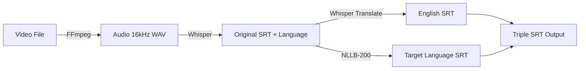

# SRTGEN - AI-Powered Subtitle Generator

<div align="center">


**GPU-accelerated subtitle generation for video files using OpenAI Whisper AI and NLLB translation**

[](https://hub.docker.com/r/agoddrie/srtgen)
[](LICENSE)
[](https://hub.docker.com/r/agoddrie/srtgen)

[Features](#-features) • [Quick Start](#-quick-start) • [Usage](#-usage) • [Configuration](#-configuration) • [Docker Hub](https://hub.docker.com/r/agoddrie/srtgen)


</div>

---

## ✨ Features

- 🎯 **AI-Powered Transcription** - OpenAI Whisper with GPU acceleration
- 🌍 **Multi-Language Translation** - Facebook's NLLB-200-1.3B for 200+ languages
- 🤖 **LLM Refinement** - Natural subtitles via Ollama integration (NLLB+LLM)
- 🎬 **Triple SRT Output** - Original language, English, and target language
- 📝 **Word-Level Timestamps** - Precise subtitle timing synchronization
- 🌐 **Modern Web UI** - Browse files, monitor jobs, configure settings
- 🚀 **Background Processing** - Queue multiple transcription jobs
- 🔍 **Smart File Browser** - Search, filter, path memory, existing SRT detection
- 📊 **Job History** - Track completed, failed, and cancelled jobs with filtering
- 🔄 **Queue Management** - Bump, cancel, and clear jobs
- 🐳 **Docker Ready** - One-click deployment on Unraid
- 💾 **Persistent Settings** - All configuration saved across restarts
- ⚡ **GPU Optimized** - CUDA acceleration for 10x faster processing
- 🎛️ **Bandwidth Control** - Configurable download speed limiting

## 🚀 Quick Start

### Docker Run (Fastest)

```bash
docker run -d --name srtgen \
  --gpus all \
  -p 5000:5000 \
  -v /path/to/media:/media \
  -e WHISPER_MODEL=medium \
  agoddrie/srtgen:latest
```

**Access:** `http://localhost:5000`

### Docker Compose (Recommended)

Create `docker-compose.yml`:

```yaml
version: '3.8'
services:
  srtgen:
    image: agoddrie/srtgen:latest
    container_name: srtgen
    ports:
      - "5000:5000"
    volumes:
      - /mnt/user/TV-Series:/media/tv:rw
      - /mnt/user/Movies:/media/movies:rw
    environment:
      - WHISPER_MODEL=medium
    deploy:
      resources:
        reservations:
          devices:
            - driver: nvidia
              count: all
              capabilities: [gpu]
    restart: unless-stopped
```

Start:
```bash
docker-compose up -d
```

### First Run Setup

Install translation dependencies (one-time):
```bash
docker exec -it srtgen pip install transformers sentencepiece protobuf sacremoses
```

### Unraid Template

1. Go to **Docker** tab → **Add Container**
2. Click **Template repositories** → Add: `https://github.com/agoddrie/srtgen`
3. Search for **SRTGEN**
4. Configure paths and click **Apply**

## 📋 Requirements

- **NVIDIA GPU** (recommended for speed)
- Docker with NVIDIA Container Runtime
- 8GB+ VRAM for medium Whisper model + NLLB-1.3B

## 🎮 Usage

### Web Interface (Recommended)

1. **Open browser:** `http://localhost:5000`
2. **Browse media folders** or use search
3. **Select video file** (MKV, MP4, AVI)
4. **Choose language** or enable auto-detect
5. **Configure overwrite** settings
6. **Click "Generate Subtitles"**
7. **Monitor progress** in sidebar

### Command Line Interface (CLI)

Run transcription directly from terminal:

```bash
# Basic usage (auto-detect language, generates original.srt + en.srt + nl.srt)
docker exec srtgen python3 /app/mkv_transcribe.py /media/movie.mkv -l nl

# With options
docker exec srtgen python3 /app/mkv_transcribe.py \
  /media/movie.mkv \
  -l fr \
  --model medium \
  --overwrite

# Original language only (skip translations)
docker exec srtgen python3 /app/mkv_transcribe.py \
  /media/movie.mkv \
  --original-only
```

**CLI Options:**
```
positional arguments:
  mkv_file              Path to MKV file

options:
  -l, --language LANG   Target language code (en, nl, de, fr, etc.)
  --model MODEL         Whisper model: tiny, base, small, medium, large
  --overwrite           Overwrite existing SRT files
  --original-only       Skip EN and target translations
  --keep-audio          Keep extracted audio file (debug)
```

### Bazarr Integration

Automatically generate subtitles when Bazarr downloads new episodes/movies.

#### Setup Steps

1. **Copy post-processing script to Bazarr:**
   ```bash
   cp /mnt/user/appdata/SRTGEN/bazarr_postprocess.sh /mnt/user/appdata/bazarr/
   chmod +x /mnt/user/appdata/bazarr/bazarr_postprocess.sh
   ```

2. **Configure Bazarr:**
   - Open Bazarr web UI → **Settings** → **General**
   - Scroll to **Post-Processing**
   - Enable **Use Custom Post-Processing**
   - Command: `/config/bazarr_postprocess.sh`

3. **Set environment variables** (optional):
   ```bash
   # In Bazarr's docker-compose.yml or Unraid template
   environment:
     - SRTGEN_TARGET_LANG=nl    # Default: nl
     - SRTGEN_MODEL=medium      # Default: base
     - SRTGEN_OVERWRITE=false   # Default: false
   ```

4. **Test:**
   - Download a subtitle in Bazarr
   - Check logs: `/tmp/srtgen-bazarr/*.log`
   - Verify SRT files created next to video

#### How It Works

```
Bazarr downloads subtitle
  ↓
Triggers post-processing script
  ↓
Detects video file path (Sonarr/Radarr)
  ↓
Calls SRTGEN CLI via docker exec
  ↓
Generates: original.srt + en.srt + target.srt
  ↓
Bazarr sees new SRT files
```

**Supported:**
- ✅ Sonarr episodes
- ✅ Radarr movies
- ✅ MKV files only
- ✅ Automatic language detection
- ✅ Configurable model and target language

**Logs location:** `/tmp/srtgen-bazarr/bazarr_YYYYMMDD_HHMMSS.log`

### Output Files

For `movie.mkv`, generates:
```
movie.en.srt      # Original language transcription
movie.en.srt      # English translation (if not English)
movie.nl.srt      # Target language (e.g., Dutch)
```

### Supported Formats

- **Video:** `.mkv`, `.mp4`, `.avi`
- **Languages:** 99+ via Whisper (EN, NL, FR, DE, ES, IT, PT, PL, RU, JA, ZH, KO, AR, TR, etc.)
- **Translation:** 200+ via NLLB-200

## ⚙️ Configuration

### Translation Methods

| Method | Description | Requirements | Best For |
|--------|-------------|--------------|----------|
| **Whisper** | Audio-based transcription | None | Always works, best timing |
| **NLLB only** | Text-based translation | English SRT exists | Fast, low memory |
| **NLLB+Whisper** | Hybrid translation + timing | English SRT exists | Quality + timing |
| **NLLB+LLM** ✨ | AI-refined natural subtitles | English SRT + Ollama | Most natural, conversational |

### Ollama Integration (NLLB+LLM)

Configure in Settings → LLM Configuration:
- **Endpoint**: Ollama API URL (default: http://localhost:11434)
- **Model**: Any Ollama model (default: qwen2.5:7b)
- **Temperature**: 0.0-2.0 (default: 0.3 for consistency)

**Setup Ollama:**
```bash
# Install Ollama
curl -fsSL https://ollama.com/install.sh | sh

# Pull a model
ollama pull qwen2.5:7b

# Verify it's running
curl http://localhost:11434/api/tags
```

### Whisper Model Selection

Set via environment variable:

| Model | VRAM | Speed | Accuracy | Recommended |
|-------|------|-------|----------|-------------|
| `tiny` | ~1GB | Fastest | Good | Testing |
| `base` | ~1GB | Very Fast | Better | Quick jobs |
| `small` | ~2GB | Fast | Good | Balanced |
| `medium` | ~5GB | Moderate | Excellent | ⭐ **Production** |
| `large` | ~10GB | Slow | Best | Maximum quality |

**Example:**
```yaml
environment:
  - WHISPER_MODEL=medium
```

### Settings Modal

Access via ⚙️ icon in web UI:
- **Default Language** - Preset translation target
- Settings persist in browser localStorage

### Volume Mapping

```yaml
volumes:
  - /host/path:/media/name:rw  # Read-write required for SRT creation
```

**Important:** Use `:rw` flag to allow subtitle file creation

## 🛠️ Technology Stack

| Component | Technology | Purpose |
|-----------|-----------|---------|
| **AI Transcription** | OpenAI Whisper | Speech-to-text with 99+ languages |
| **AI Translation** | Facebook NLLB-200-1.3B | Context-aware translation (200+ languages) |
| **Backend** | Python 3.11 + Flask | REST API and job management |
| **GPU Acceleration** | PyTorch + CUDA | 10x faster processing |
| **Audio Processing** | FFmpeg | Extract audio from video containers |
| **Frontend** | Vanilla JavaScript | Lightweight, no dependencies |
| **Storage** | localStorage | Settings persistence |

### How It Works



1. **Audio Extraction:** FFmpeg → 16kHz mono WAV in `/tmp`
2. **Transcription:** Whisper with word-level timestamps + auto language detection
3. **English Translation:** Whisper's built-in translation task
4. **Target Translation:** NLLB batch processing (5 segments) with context
5. **Timestamp Adjustment:** Extends duration for longer translations
6. **SRT Generation:** Filters non-speech, formats timestamps, saves files

## 🐛 Troubleshooting

<details>
<summary><b>Translation module not found</b></summary>

```bash
docker exec -it srtgen pip install transformers sentencepiece protobuf sacremoses
```
*Note: Required on first run. Will be added to Dockerfile in future release.*
</details>

<details>
<summary><b>GPU not detected</b></summary>

Verify NVIDIA runtime:
```bash
docker run --rm --gpus all nvidia/cuda:11.8.0-base-ubuntu22.04 nvidia-smi
```

Install nvidia-container-toolkit:
```bash
distribution=$(. /etc/os-release;echo $ID$VERSION_ID)
curl -s -L https://nvidia.github.io/nvidia-docker/gpgkey | sudo apt-key add -
curl -s -L https://nvidia.github.io/nvidia-docker/$distribution/nvidia-docker.list | sudo tee /etc/apt/sources.list.d/nvidia-docker.list
sudo apt-get update && sudo apt-get install -y nvidia-container-toolkit
sudo systemctl restart docker
```
</details>

<details>
<summary><b>Template changes not visible</b></summary>

1. Hard refresh browser: `Ctrl+Shift+R`
2. Restart container: `docker restart srtgen`
3. Clear browser cache
</details>

<details>
<summary><b>Permission denied writing SRT</b></summary>

Ensure volumes use `:rw` flag:
```yaml
volumes:
  - /path/to/media:/media:rw  # Not :ro
```
</details>

<details>
<summary><b>Subtitle timing off by ~1 second</b></summary>

Word-level timestamps enabled by default. If issues persist:
- Try different Whisper model
- Check video/audio sync in source file
- Report issue with example file
</details>

## 📦 Building from Source

```bash
git clone https://github.com/agoddrie/srtgen.git
cd srtgen
docker build -t agoddrie/srtgen:latest .
docker-compose up -d
```

## 🤝 Contributing

Contributions welcome! Please:

1. Fork the repository
2. Create feature branch (`git checkout -b feature/amazing`)
3. Commit changes (`git commit -m 'Add amazing feature'`)
4. Push to branch (`git push origin feature/amazing`)
5. Open Pull Request

### Development Setup

```bash
# Clone repo
git clone https://github.com/agoddrie/srtgen.git
cd srtgen

# Build image
docker build -t srtgen:dev .

# Run with hot-reload
docker run -it --rm \
  --gpus all \
  -p 5000:5000 \
  -v $(pwd)/app.py:/app/app.py \
  -v $(pwd)/mkv_transcribe.py:/app/mkv_transcribe.py \
  -v /media:/media:rw \
  srtgen:dev
```

## 📊 Benchmarks

Test file: 22-minute episode (The IT Crowd S01E01)

| Model | GPU | Time | Accuracy | VRAM |
|-------|-----|------|----------|------|
| tiny | RTX 5070 Ti | 45s | 85% | 1.2GB |
| base | RTX 5070 Ti | 1m 15s | 92% | 1.5GB |
| small | RTX 5070 Ti | 2m 30s | 96% | 2.8GB |
| **medium** | **RTX 5070 Ti** | **4m 20s** | **98%** | **5.2GB** |
| large | RTX 5070 Ti | 8m 45s | 99% | 10.5GB |

*Translation adds ~2-3 minutes for NLLB-1.3B processing*

## 📄 License

MIT License - See [LICENSE](LICENSE) file

**Third-party components:**
- OpenAI Whisper - [MIT License](https://github.com/openai/whisper/blob/main/LICENSE)
- Facebook NLLB - [CC BY-NC 4.0](https://github.com/facebookresearch/fairseq/blob/nllb/LICENSE)
- FFmpeg - [GPL/LGPL](https://ffmpeg.org/legal.html)

## 🙏 Acknowledgments

- [OpenAI Whisper](https://github.com/openai/whisper) - Robust speech recognition
- [Facebook NLLB](https://github.com/facebookresearch/fairseq/tree/nllb) - High-quality translation
- [FFmpeg](https://ffmpeg.org/) - Multimedia framework
- [Flask](https://flask.palletsprojects.com/) - Web framework
- [PyTorch](https://pytorch.org/) - Deep learning platform

## ⭐ Support

If you find SRTGEN useful, please:
- ⭐ Star the repository
- 🐛 Report bugs via [Issues](https://github.com/agoddrie/srtgen/issues)
- 💡 Request features
- 📖 Improve documentation
- 🔄 Share with others

---

<div align="center">

**Made with ❤️ for the Unraid community**

[Docker Hub](https://hub.docker.com/r/agoddrie/srtgen) • [GitHub](https://github.com/agoddrie/srtgen) • [Issues](https://github.com/agoddrie/srtgen/issues)

</div>
